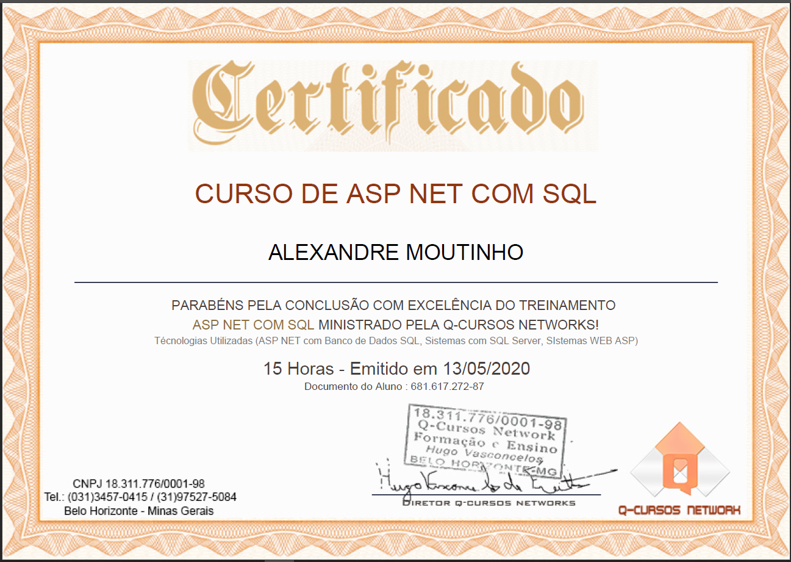
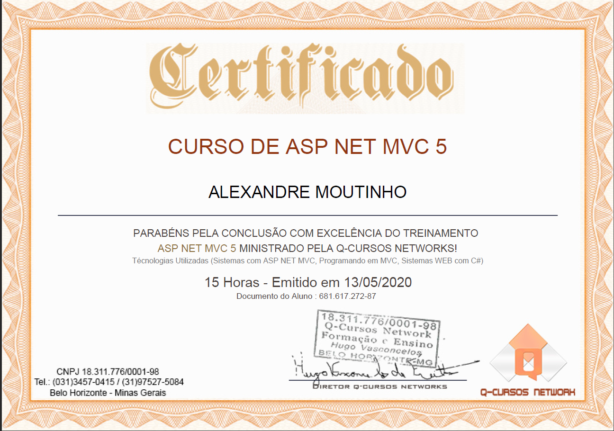
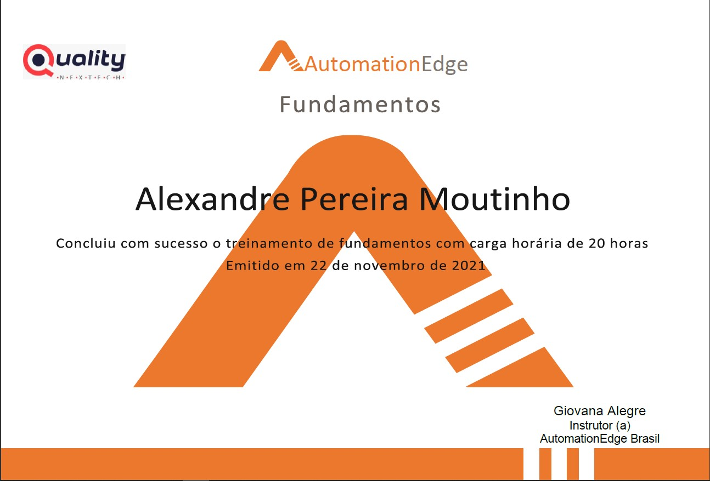

# #--------< Certificado de Cursos Realizados >---------#

#  Nome: ALEXANDRE PEREIRA MOUTINHO  
#  Cotatos: ☎: (41) 9 983372-12 | ✉: alexandre.moutinho@outlook.com.br ou cel.moutinho@gmail.com 

## 👨‍🎓 Conhecimento Adquirido:

- > HTML5:
    

- > C Sharp Funamentos e Avançando:
    * C# do Basico ao Avançado -- COD3R
    
    
    * C# Fundamentos -- Balta.oi
    

- > NET/ASP NET/MVC:
    * ASP NET com SQL Server  -- Q-Cursos Networks
    
    * ASP NET MVC  -- Q-Cursos Networks
    
    

- > RPA

    * RPA com Python Basico   -- Udemy
    
    * RPA Plataforma AutomationEdge Funamentos -- AutomationEdge Brasil
    
