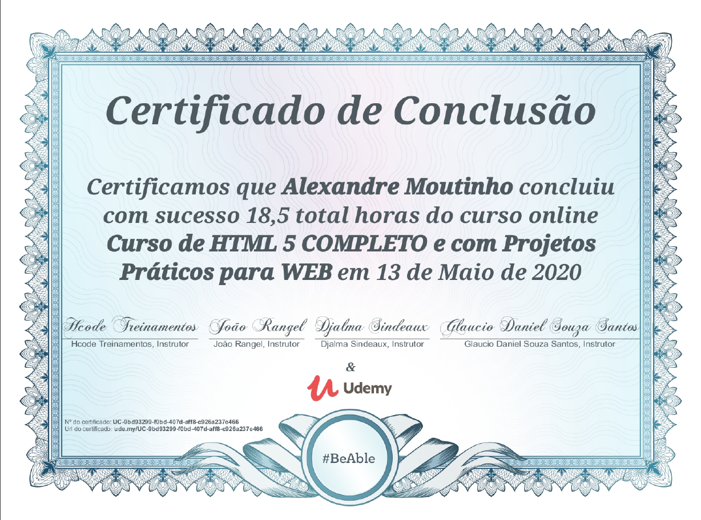

# #-----------------< Certificado de Cursos Realizados >----------------#

#  Nome: ALEXANDRE PEREIRA MOUTINHO  
#  Cotatos: ☎: (41) 9 983372-12 | ✉: alexandre.moutinho@outlook.com.br ou cel.moutinho@gmail.com 

## 👨‍🎓 Conhecimento Adquirido:

- > HTML5:
    

- > C# Funamentos e Avançando:
    
    

- > NET/ASP NET/MVC:
    
    

- > RPA
    
    
